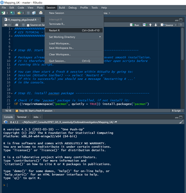

```{r setup, include=FALSE}
knitr::opts_chunk$set(echo = TRUE, 
                      eval = TRUE,
                      message = FALSE, 
                      warning = FALSE, 
                      ft.align = "left",
                      #fig.width = 12,
                      out.width = "100%")
```


```{r restrict output, echo=FALSE}

################################################################
# FUNCTION TO RESTRICT RESULTS TO A FEW LINES OF OUTPUT:

# Check if knitr is installed, if not install it:
if (!requireNamespace("knitr", quietly = TRUE)) install.packages("knitr")

# Load knitr
library(knitr)

# Define empty output:
hook_output <- knit_hooks$get("output")

# Function to restrict lines of output:
knit_hooks$set(output = function(x, options) {
  lines <- options$output.lines
  if (is.null(lines)) {
    return(hook_output(x, options))  # pass to default hook
  }
  x <- unlist(strsplit(x, "\n"))
  more <- "..."
  if (length(lines)==1) {        # first n lines
    if (length(x) > lines) {
      # truncate the output, but add ....
      x <- c(head(x, lines), more)
    }
  } else {
    x <- c(more, x[lines], more)
  }
  # paste these lines together
  x <- paste(c(x, ""), collapse = "\n")
  hook_output(x, options)
})

``` 


\newpage

------------------------------------------------------------------------

# Introduction {.tabset .tabset-pills}

## Version history

This case study was originally developed by Daniel Gardiner and Amy Mikhail for a beginner's R course for epidemiologists that was run in Public Health England from 2017 to 2019.  The case study is based on an outbreak that occurred in the South West of England in 2014.  The data sets used in this exercise are derived from the original outbreak, but they have been anonymised (postcodes jittered and patient identifying information removed).  

The material was then adapted for the UK FETP Outbreak Tools module in 2019.

Substantial changes were made prior to the EPIET Outbreak Investigation module in Berlin in 2021.  In particular:

  + All packages were updated and replaced with tidyverse compatible packages
  + The example code has been substantially updated and converted to tidyverse syntax.
  + The code has been simplified to minimise the number of data transformation steps.

Further modifications were made based on user feedback after the module and prior to running it during the EAN GIS mini-module in Rome in 2022. 

The latest version in preparation for the EPIET Outbreak Investigation module in Berlin in 2022 comprises primarily of formatting modifications, to make the HTML document easier to navigate.  In addition, the case study has been published to a Github IO page to facilitate easier access on-line.

\newpage

## Guide for use

This tutorial has been developed to demonstrate how to create static and interactive point and choropleth maps in R.  The tutorial follows a case study based on a real outbreak that occurred in the South West of England and required some geo-spatial analysis to solve. Note that all the demonstrated steps can be applied to data from any country.   

It is structured as follows:

   + A participant pack is provided containing this guide and the required datasets
   + Some background text introduces the case study and provides questions to answer
   + Each section is introduced with some further background
   + The R code needed to create each map is explained in the text
   + To view or hide the R code, toggle the `Show / hide code` button at the top of this document, or individually above each code chunk.
   + The maps are then displayed.
   + Appendix A is an optional exercise demonstrating how to clean postal (zip) codes that conform to a standard format with a regular expression.
   + Appendix B is an optional exercise demonstrating how to map addresses to GPS coordinates.
   + Appendix C provides further details on how the density mapping parameters are set.

Note that this tutorial uses `tidyverse` packages and syntax.  It follows the strategies demonstrated in the [GIS basics chapter of the Epidemiologist R handbook](https://epirhandbook.com/en/gis-basics.html).

Map tiles in this tutorial are now downloaded from OpenStreetMap, as this service is free. We no longer recommend using map tiles from Google maps as access to their service is now by paid prescription only.

For each processing step, **one example** has been provided; in order to answer the case study questions, you may need to repeat this code for other variables in the data set or adapt some of the arguments as needed.  Each exercise includes an `Exploratory

Finally, note that wherever a package that is not part of base R has been used, the function is preceded by the package name, e.g.: `stringr::str_replace()` is the `str_replace` function from the `stringr` package.  This should make it easier to identify which packages you will need to use when writing your own mapping code.  For the same reason, wherever possible arguments within functions have been explicitly named, so that you can identify and read about the accepted values for these arguments in the package help files.

\newpage

## Prerequisites

This tutorial is not intended to be an introduction to using R; if you are new to R, we recommend that you work through the first 16 chapters in the `Basics` and `Data management` sections of the [Epidemiologist R handbook](https://epirhandbook.com/en/index.html), prior to taking this course.  This tutorial follows the same processes and packages to import and clean the data prior to mapping.

If you are still struggling to understand the R code in this tutorial, don't worry; we recommend that you focus on understanding how each type of map is used to aid the investigation and how to interpret the output.  If you wish to follow this tutorial without executing the code, you can hide the code chunks by toggling the `Show / hide code` button at the top right of this document.

If you do feel comfortable enough to try out the code, we suggest that you work with the un-annotated R markdown document provided in the participant pack.  It contains the same code chunks as this document, but without the explanatory text.  A good way to become familiar with the code is by modifying the arguments and then running the chunk again, to see what effects this has on the output.  

If you have succesfully completed this tutorial and have some extra time, you may wish to try adapting the code and trying it out on your own geo-spatial data.    

\newpage

## R Setup

### Software requirements

To work through this tutorial, you will need:

   + recent version of R (>= 4.2.x) 
   + recent version of Rstudio (>= 2022.07.x)
   + required packages installed (see below)
   + internet connection (required for geocoding and downloading static map tiles)


### Installing R packages

This section describes how to install and load the packages that you will need for this mapping tutorial.  Some brief details on why each package was selected are provided below:

   + `pacman` - Checks for, installs (if needed) and loads multiple packages at once
   + `rio` - import multiple different data types with a single command
   + `here` - import and export data using relative file paths
   + `janitor` - handy functions for data cleaning
   + `tidyverse` - collection of packages based on tidy data format and dplyr syntax
   + `tidygeocoder` - geocoding (converting UK postcodes to longitude and latitude)
   + `sf` - converts meta data and coordinates to a "simple feature" object for maps 
   + `osmdata` - free OpenStreetMap resource for creating map boundary boxes
   + `ggmap` - "grammar of graphics" package for creating and displaying static maps
   + `scales` - create pretty breaks for choropleth maps
   + `leaflet` - java package for making interactive maps with more complex features
   + `htmlwidgets` - allows saving of leaflet maps as html files
   
To ensure that the package installation goes smoothly, you have been provided with a separate package installation script.  

  1. Prior to running this script, you should close any open instances of R and RStudio
  2. Open a fresh instance of RStudio
  3. Within RStudio, browse for and open the package installation script
  4. Restart R by going to `Session` and then `Restart R` in the top toolbar of the RStudio menu as shown in the image below.
  5. Run the code in the script as instructed, to install the packages.
  6. If prompted to update or install additional packages, select the `From CRAN` option.
  7. If you encounter any issues, please contact the organizers for help.





After starting a fresh RStudio and R session, you will first need to install the `pacman` package.  This package has a function which makes installing and loading other packages much easier.  The code below will first check to see if `pacman`is already installed in your R library, and if not, install it:  

```{r package_installs}

##################################################################
# INSTALL PACKAGES

# Check if the 'pacman' package is installed, if not install it:
if (!requireNamespace("pacman", quietly = TRUE)) install.packages("pacman")


```

Next, you can use the `pacman::p_load()` function to check if the rest of the packages required for this tutorial are already installed in your R library.  Any missing packages will be automatically installed with this function.  

```{r package_loading}

##################################################################
# LOAD LIBRARIES

# Load the required libraries into the current R session:
pacman::p_load(rio,
               here,
               janitor,
               tidyverse,
               tidygeocoder,
               sf,
               osmdata,
               ggmap,
               scales,
               leaflet,
               htmlwidgets)

```

Note that each time you restart R or RStudio, you will need to rerun the `pacman::p_load()` function to load the required libraries into your current session.  We therefore suggest you copy this code and paste it at the top of the R script that you will use for this exercise. 

Adding the argument `update = TRUE` will automatically install the most recent versions of the listed packages if those versions are higher than the ones in your R library.  Once you have installed the packages for this course, we suggest setting this option to `FALSE` in your R script, or removing it.

If you have any problems with package installation or loading, please contact the facilitators for help before proceeding.


### File organization and housekeeping

In this tutorial, files are imported and outputs exported using relative file paths with the help of the `here` package. 

  1. For this to work seamlessly, we suggest that you download the folder containing all the course materials and save it on your desktop. 
  2. Next, open the folder and double-click on the the 'Mapping_UK.Rproj' file, which will open a new instance of RStudio.  
  3. If you click on the 'files' pane in RStudio, you should now be able to see all the sub-folders containing the course materials. 
  4. Go to the `File` menu in RStudio and select `New file --> R script`.
  5. Name the R script (e.g. `My_GIS_code.R`) and save it in the same folder.
  6. Add the `pacman::p_load()` function including the required packages as shown in the code chunk above to the top of your script, changing the `update` argument to `FALSE`.
  7. Run this code to load the required libraries into your current R session.

You are now ready to begin.

\newpage

## Case study


### Background

This exercise is based on an outbreak associated with raw drinking milk that was contaminated with shiga toxin-producing *Escherichia coli* (STEC). A substantial increase in cases was first detected in 2014.

The outbreak was notified to public health authorities after 9 people, who had visited a farm producing raw milk in the South West of England in September and October 2014, fell ill.  The farm routinely produced and sold raw milk at local markets, but was also open to visitors in the spring and summer time.  Visitors had been exposed either through interacting with the animals and their environment or from drinking a sample of the raw milk.  Samples of raw milk from this farm also tested positive for STEC, implicating this farm as the biological source of the outbreak.

Whole genome sequencing later confirmed that the isolates from the 9 cases and from the raw milk sample all belonged to the same 5-single nucleotide polymorphism (SNP) cluster (i.e. were very closely related genetically). 

Surprisingly, the whole genome sequencing cluster also included isolates from 36 other cases that were not known to have visited the implicated farm during the outbreak period.  Twelve of these cases were new (identified late 2014 or early 2015) and had not yet been associated with any outbreak.  The remaining additional cases were historic (identified between 2009 and 2012) and had been associated with other outbreaks linked to two farms and two schools which were also located in the same region in the South West of England.  

This raised questions for the Outbreak Control Team (OCT); they were particularly concerned about the 12 new cases that had no known links with the implicated farm.  The OCT decided to investigate the exposure histories of all the cases in the whole genome sequencing cluster.  

The OCT compliled a case line list of exposure histories, which were extracted from the National STEC enhanced surveillance system (NSESS).  The NSESS had been in place since 2009.  Of specific interest for this outbreak, the surveillance questionnaire records exposures to raw milk, farm visits and any overnight stays outside the normal place of residence in the 14 days before symptom onset. The full address of the case's normal place of residence and any locations visited in the UK for day trips (such as a farm) or overnight stays are also recorded.  

Routine whole genome sequencing was implemented for all STEC cultures received by the national reference laboratory from January 2014.  In addition, randomly selected samples from all outbreaks investigated in the previous five years were sequenced retrospectively.  Sequencing data is relatively new to the OCT; they are therefore particularly anxious to determine if the genetically linked case isolates also have an epidemiological link to the implicated farm.  As the spatial distribution of the cases who had not visited the farm is unknown, the OCT have asked you to undertake some geospatial analysis and investigate further.

To conduct your analysis, the OCT has provided you with a case line list that includes information on whole genome sequencing clustering, association with investigated outbreaks, geospatial exposures, and exposure to raw animal products. The line list also includes the geographic coordinates of case residence addresses and other sites of potential exposure. 

The following variables will be critical for your analysis:

   + `wgs_rdm_cluster`: Indicates if case isolates are part of the WGS cluster associated with this raw drinking milk (RDM) outbreak (`TRUE` if yes, `FALSE` if they are from a different WGS cluster)
   + `epi_outbreak`: Indicates which outbreak investigation each case is linked to. Options are this outbreak (RDM 2014), Farm A, Farm B, School A, School B, or sporadic (not linked to an outbreak).
   + `postcode_home`: UK postcode of residence
   + `postcode_uk_travel`: UK postcode of day trips or overnight stays in the 14 days before onset
   + `postcode_exposure`: UK postcode where exposure to raw milk most likely occurred.

Note that `postcode_exposure` is the postcode of the location where the OCT thinks exposure for that case most likely occurred; if the case visited the implicated farm or a nearby area, then that is considered the site of most likely exposure.  On the other hand, for cases with no known links or visits to the South West region, their postcode of residence is used as the exposure postcode.  

Note that the `postcode_exposure` for all 9 cases in the `RDM 2014` outbreak is the postcode of the farm in the South West of England that had been identified as the source of infection for this outbreak.


### Materials

For this case study, the following materials have been provided:

   + [Mapping in R case study guide](https://epiet.github.io/OutbreakInvestigations/Mapping_R_guide.html) (online version)
   + [Mapping in R case study materials](https://github.com/EPIET/OutbreakInvestigation/raw/master/Mapping/Mapping_R_casestudy.zip) (.zip folder).
   
The case study materials are in a folder called `Mapping_R_casestudy` which includes:

   + `guide` folder (offline versions of this document)
   + `rcode` folder (R coding template companion to this document and packages2install.R)
   + `shapefiles` folder (shape files for health regions)
   + `data` folder which contains the following data sets:
     - `CaseStudy_RDM_anon_data.csv` - raw data set
     - `CaseStudy_RDM_anon_data_cleanpcodes.csv` - raw data with pre-cleaned postcodes
     - `CaseStudy_RDM_anon_data_coords.csv` - raw data with geographic coordinates added
     - `PHEC_population.csv` - regional population data for choropleth incidence maps

Note that this case study requires an internet connection as follows:

   + to install required packages
   + to download map tiles (required for most of the maps)
   + to geocode address postcodes (optional exercise in appendix B)


### Key questions to answer

The OCT were surprised to learn that some additional cases, both historic and new, were also linked to this outbreak via whole genome sequencing.  By mapping the cases in different ways and looking at their geo-spatial distribution, what conclusions can you draw about the following questions?

  1. Does the geo-spatial distribution of cases confirm or refute the hypothesis that the source of infection for all cases in the WGS cluster is farmland in the South West region?
  2. Based on their geo-spatial distribution over time, are the historic cases likely to have been exposed to the same source of infection as cases from the current outbreak?
  3. Overall, does the geo-spatial evidence best support the cluster defined by whole genome sequencing (`wgs_rdm_cluster`) or by epidemiological links (`epi_outbreak`)?


\newpage  

------------------------------------------------------------------------

# Geospatial investigations in R {.tabset .tabset-pills}


## Data prep


### Import data

In this section, we will read in (import) the raw data sets into R.  You can find the data sets in a sub-folder called `data` which should be in the folder of course materials provided to you for this exercise.

We will use the package `rio` to import the outbreak line list and regional population data, with the command `rio::import()`.  The `here` package is used to define the path to the files we want to import, as this package facilitates the use of relative file paths, which will work on any computer, provided you have the same participant pack folder.

After importing the data, we will use the `clean_names()` function from the `janitor` package.  This function removes non-alphanumeric characters and spaces from column names in a data set, to make them easier to reference in r code.  It will also change all the column names to lower case.  Spaces are replaced with an underscore.


```{r import csv files}

###########################################################################
# Import outbreak case linelist

# Import the outbreak case line list, which includes residence coordinates:
caselist <- rio::import(file = here("data", 
                                    "CaseStudy_RDM_anon_data_coords.csv")) %>%
  # Clean variable names:
  janitor::clean_names() %>% 
  
  # Create nice labels for the Raw drinking milk (RDM) cluster variable:
  dplyr::mutate(wgs_rdm_cluster = case_when(
    wgs_rdm_cluster == TRUE ~ "A. Raw milk cluster", 
    wgs_rdm_cluster == FALSE ~ "B. Other cluster")) 


###########################################################################
# Import population data for health regions

# Import the population data for health regions (called PHE centres):
region_pop <- rio::import(file = here("data", 
                                      "PHEC_population.csv")) %>% 
  
  # Clean variable names: 
  janitor::clean_names()

```


Next, we will import the shape files for the borders of 9 health regions (called PHE Centers or PHEC for short) that we will superimpose onto some of the maps. Shape files have a more complex structure, so we need to use the `sf` package to import them ('sf' stands for 'simple feature'). The `sf` package is part of the `tidyverse` so the shape files are imported as a `data.frame` which is easy to interrogate:

```{r import shape files}

# Import the shape files for 9 health regions (called PHEC or PHE Centres): 
region_sf <- sf::st_read(dsn = here("shapefiles", "En_PHE_Centre.shp")) %>% 
  
  # Clean variable names:
  janitor::clean_names()

```

You can see in the printed information about the imported shape files, that the coordinate reference system (CRS) used for the health regions is the British National Grid. It is important that the same coordinate reference system is used for the map tiles, for case addresses and for any borders superimposed on the map.  Case addresses have been mapped to Global Positioning System (GPS) coordinates, which is a different system, so we will have to transform the shape files to this system to make sure they match up.  

Fortunately, we can use the `sf::st_transform()` function to do this.  The main argument required is `crs` (coordinate reference system).  The CRS cannot be specified as a text string; instead we need to supply the EPSG code for the system we want to transform to, which is `4326`.  You can find more information about the EPSG codes of two common coordinate reference systems [here](https://geo.nls.uk/urbhist/guides_coordinates.html).

```{r}

region_sf <- sf::st_transform(x = region_sf, crs = 4326)

```


These shape files have been taken from the ESRI online shape file collection.  The collection has shape files for different administrative levels of most countries, but you normally need a licence for ArcGis software to access them.  However there are many free shapefile collections; for example the OpenDataSoft collection, which you can browse [here](https://public.opendatasoft.com/explore/dataset/world-administrative-boundaries/information/).


### Calculate crude incidence rates

In this section we will calculate crude incidence per 100 000 population by health region (the health regions are called PHE Centres in this data set) and add them to the health region shape file.  To do this, we will need to prepare the following:

  1. Create a summary table of case counts by PHE Centre from the data set `caselist`
  2. Add the population for each PHE Centre to this table from the data set `region_pop`
  3. Calculate incidence per 100 000 population as a new variable in the table
  3. Merge this incidence table with the health regions shapefile `region_sf`

Note that the names of the PHE Centres are stored in a variable called `phecnm` in all three of the data sets that you imported (case line list, region populations and region shape file).

```{r calculate incidence}

# Create the table of summary counts of cases by PHE Centre:
incidencetab <- caselist %>% 
  group_by(phecnm) %>% 
  summarise(cases = length(caseid))

# Add population data to the table:
incidencetab <- region_pop %>% 
  left_join(incidencetab, by = "phecnm")

# Change NA counts to 0 for incidence calculation:
incidencetab <- incidencetab %>% 
  mutate(cases = ifelse(is.na(cases), 0, cases))

# Calculate crude incidence per 100,000 population:
incidencetab <- incidencetab %>% 
  mutate(Incidence = round((cases/population)*100000, 2))

# Update the health regions shapefile by merging the incidence table with it:
region_sf <- region_sf %>% 
  left_join(incidencetab, by = "phecnm")

```

**Exploratory tasks:**

   + Inspect the `incidencetab` data.frame after each command to check what has changed

   + Try piping together all the commands to create the incidence table 
   + (hint: they are currently separated to make it easier to interogate each step)

   + Try rounding crude incidence to more or fewer decimal points
   + (hint: this is specified in `mutate(Incidence = round(..., 2))`).

Note that if some regions have very low incidence, you may wish to include more numbers after the decimal point - the aim is to easily distinguish between incidence rates in the different regions on a numeric scale, as we will see later when we create the choropleth map.


### Mapping cases

In the following sections, we will explore the spatial distribution of the cases by creating maps using the `sf`, `ggmap`, `ggplot2` and `leaflet` packages.  

For creating static maps, we will also need to download the coordinates that will define the edges of our background map.  We will do this using the `osmdata` package, which fetches background maps for a given boundary area from OpenStreetMap.

In the case linelist data (`caselist`), latitude and longitude are provided for three different types of address as follows :

  + `home_lat` and `home_long`: where the case lives (their normal residence)
  + `travel_lat` and `travel_long`: location of implicated day trips (e.g. farms visited) 
  + `exposure_lat` and `exposure_long`: where case was exposed (their residence or a farm)

These variables will be used for mapping the cases.

\newpage

## Base maps

### Importing map tiles from a web service

To create a static map of cases, we will first import data to create a background map of the UK using the `osmdata` package.  You can define the boundary box for the map you want to import simply by typing the country name (or region and country name if you want to focus on one region).  A list of country names and their corresponding codes is provided on the [OpenStreetMap Nominatim country code wiki page](https://wiki.openstreetmap.org/wiki/Nominatim/Country_Codes).  Note that OSM is fairly flexible with country names and will usually accept commonly used abbreviations as well as the official name or code.


We will then use this boundary box to fetch a nice background map from OpenStreetMap with the `ggmap` package.  Note that it used to be possible to bulk geocode and define boundary boxes with Google maps as well, but this is now exclusively a paid service.  If your organisation does pay for this service, you can use it by providing an API key as one of the arguments.  For this exercise, we will only use OpenStreetMap as it is a free service.

This map will be used as the base layer.  


```{r boundary box UK}

# First, define the boundaries of the map you want to import:
ukbb <- osmdata::getbb(place_name = "United Kingdom", featuretype = "country")


# Next, get the base layer map matching this boundary box: 
ukmap <- ggmap::get_map(location = ukbb, 
                        maptype = "terrain", 
                        source = "stamen")

# Have a quick look at the base map:
ggmap(ukmap)


```


Getting a map of the whole of the UK produces a lot of empty space (ocean) because it includes some small islands to the north of Scotland.  In this outbreak, all the cases are actually located in England (a level 4 administrative boundary within the UK).  We can zoom in by creating a boundary box just for England instead (note that England is considered a 'settlement' within the 'country' of UK):

```{r boundary box England}

# First, define the boundaries of the map you want to import:
englandbb <- osmdata::getbb(place_name = "England", featuretype = "settlement")


# Next, get the base layer map matching this boundary box: 
englandmap <- ggmap::get_map(location = englandbb, 
                             maptype = "terrain", 
                             source = "stamen")

# Have a quick look at the base map:
ggmap(englandmap)

```


We already know that a lot of the cases are concentrated in the South West of England (near the farm that was the likely source of the contaminated raw milk).  We can be even more precise with the boundary box by supplying it with the range (maximum and minimum) of coordinates defining the area in which the cases are found:

```{r boundary box case coordinates}

# First define the boundary box with case coordinates:
cbbox <- ggmap::make_bbox(lon = home_long,
                          lat = home_lat, 
                          data = caselist,
                          f = 0.1)


# Next, get the base layer map matching this boundary box: 
coordinatesmap <- ggmap::get_map(location = cbbox, 
                                 maptype = "terrain", 
                                 source = "stamen")

# Have a quick look at the base map:
ggmap(coordinatesmap)

```

**Exploratory tasks:**

Note that when defining the boundary box, the `f` value (fraction by which the range should be extended beyond the minimum and maximum coordinates) will affect the zoom level of the map.  A higher resolution map will also include more place names at a lower administrative level.

   + Try changing the `f` value and see what looks best
   + Choose the base map that you think best defines the area of interest
   + (use this base map in the next section)


### Adding layers to map tiles:

In this section we will add the case coordinates to the base map that we defined in the previous section (`coordinatesmap`) in a new layer with `ggmap` to create a point map.  You can also adjust the colour, shape and size of the points.


```{r point map with web tiles}

# Fetch the selected base map tiles:
pointmap_web <- ggmap::ggmap(coordinatesmap, 
                             extent = 'panel', 
                             maprange = FALSE) +
  
  # Add case residence coordinates:
  geom_point(data = caselist, 
             aes(x = home_long, 
                 y = home_lat), 
             colour = "black",
             fill = "darkred",
             alpha = 0.5,
             size = 4, 
             shape = "circle filled", 
             show.legend = TRUE) +
  
  # Label x and y axes of map:
  labs(x = "Longitude", 
       y = "Latitude")
  
# Have a look at the map:
pointmap_web  

```


In case the map is not already part of an automated report, we can also save it to a .pdf file, specifying the width, height and resolution (dpi):

```{r}

# Save the map as a .pdf
ggplot2::ggsave(filename = "Map of cases - static.pdf", 
              plot = pointmap_web, 
              width = 9, 
              height = 9, 
              dpi = 300)


```


**Exploratory tasks:**

In the example code in this tutorial, we have only used one of the three addresses available for cases (their residence address, defined by `home_long` and `home_lat`).  The other two geocoded addresses available are for locations cases traveled to on a day trip (`travel_long` and `travel_lat`) and the location of likely exposure to the contaminated raw milk (`exposure_lat` and `exposure_long` - note this is a composit of the other two addresses).

   + Try recreating this case map, but use the exposure coordinates instead
   + (hint: change the x and y variables in the aes)
   + Repeat the case map again, but using the UK travel coordinates instead
   + Which coordinates do you think are most informative?


### Using shape files as the base map

We will use the shape files of PHE Centres (9 health regions in England) to create the base layer for our map and plot the points on top, as before.  Remember that we already imported the shape files and saved them as an object called `region_sf` at the beginning.

This time, we will use the `ggplot2` package to first create the empty frame for the map, as it is not possible to have an empty frame with the `ggmap` package.

We will then add the shape files as a base layer with `geom_sf()`. Finally, we will add the case coordinates on top using the same code as for the previous map.

```{r point map with shape files}

# Plot an empty frame:
pointmap_sf <- ggplot2::ggplot() + 
  
  # Add the base map using health region shape files:
  geom_sf(data = region_sf, 
          colour = "black", 
          fill = "darkgreen",
          alpha = 0.5,
          size = 0.75) +
  
  # Add the case home residence coordinates:
  geom_point(data = caselist, 
             aes(x = home_long, 
                 y = home_lat), 
             colour = "black",
             fill = "darkred",
             alpha = 0.5,
             size = 4, 
             shape = "circle filled", 
             show.legend = TRUE) +
  
  # Label the x and y axes:
  labs(x = "Longitude", 
       y = "Latitude")

# View the map:
pointmap_sf

```


**Exploratory tasks:**

In this map, we first started with the shapefile layer, where we specified how we would like the base map to look (colour and thickness of region borders, fill colour and transparency).

   + Try changing the base map fill colour and transparency (alpha)
   + (hint: change the parameters in `geom_sf`)
   + Select the background map and points colour and transparency levels that work best.

\newpage

## Stratified maps

It might be useful to see how cases are spatially distributed when they are stratified by a grouping variable.  There are two ways to do this:

  1. Distinguish the case coordinate points by fill colour, size or shape;
  2. Create separate maps for each stratum and display them as a group.


### Stratifying by aesthetic attributes

Cases were originally defined in terms of time, place and STEC subtype.  However later, whole genome sequencing results became available.  This showed that not all case isolates fell into the the same whole genome sequencing cluster as the strain of STEC that had been found in the raw milk (hereafter referred to as the raw milk cluster). The variable that we will use for this stratification is called `wgs_rdm_cluster`.

First, we will stratify by WGS cluster using the OpenStreetMap tiles and boundary box that we created earlier (called `coordinatesmap`).  We can stratify simply by making the case coordinate points have a different fill colour, depending on which WGS cluster they belong to:

```{r stratified point map with web tiles}

# Create the base map from selected OpenStreetMap tiles:
stratamap_web <- ggmap::ggmap(coordinatesmap, 
                              extent = 'panel', 
                              maprange = FALSE) +
  
  # Add the case coordinates:
  geom_point(data = caselist, 
             aes(x = home_long, 
                 y = home_lat, 
                 fill = wgs_rdm_cluster), # Here we specify the stratifier
             colour = "black",
             alpha = 0.5,
             size = 4, 
             shape = "circle filled", 
             show.legend = TRUE) +
  
  # Label the x and y axes:
  labs(x = "Longitude", 
       y = "Latitude") + 
  
  # Manually specify the colours of each stratum:
  scale_fill_manual(values = c("darkred", 
                               "turquoise")) + 
  
  # Manually specify the title of the strata legend:
  labs(fill = "Whole genome sequencing cluster")

  
# Have a look at the map:
stratamap_web  


```


We can now repeat this process to create another stratified map, using the health region shape files as the base map instead:

```{r stratified point map with shape files}

# Plot an empty frame:
stratamap_sf <- ggplot2::ggplot() + 
  
  # Add the base map using health region shape files:
  geom_sf(data = region_sf, 
          colour = "black", 
          fill = "darkgreen",
          alpha = 0.5,
          size = 0.75) +
  
  # Add the case home residence coordinates:
  geom_point(data = caselist, 
             aes(x = home_long, 
                 y = home_lat, 
                 fill = wgs_rdm_cluster), # Here we specify the stratifier
             colour = "black",
             alpha = 0.5,
             size = 4, 
             shape = "circle filled", 
             show.legend = TRUE) +
  
  # Label the x and y axes:
  labs(x = "Longitude", 
       y = "Latitude") +
  
  # Manually specify colours for strata levels:
  scale_fill_manual(values = c("darkred", 
                               "turquoise")) +
  
  # Manually specify legend title for strata:
  labs(fill = "Whole genome sequencing cluster:") 

# View the map:
stratamap_sf


```


**Exploratory tasks:**

In the two stratified maps, we specified how the points should look, with the `colour` (of shape border), `size`, `shape`, and `alpha` (transparency level of fill colour) arguments.  We also specified exactly which colours to use for the stratified variable with `scale_fill_manual()`. You can find more information about the different formatting options for points and other ggplot features by typing `vignette("ggplot2-specs")` in your R console (the vignette will open in the help pane of RStudio).

   + Try changing the `alpha` (transparency) - what effect does it have on overlapping points?
   + Try changing the `shape` to `circle` - what happens to the border colour of the points?
   + Try changing the variables to stratify on - what else could be interesting?
   + (hint: change the fill variable in aes)
   + (hint: make sure you provide enough colours for each factor level in `scale_fill_manual`)
   + (hint: change the title of the legend in `labs(fill = ...)`)


### Stratifying with facets:

Another approach to stratification is to create separate maps for each factor level of the stratifying variable.  To do this, we can apply the function `ggplot2::facet_wrap()` to one of the maps we already made.

This approach is often used to show how case distribution changes over time, with each map representing an aggregated time unit, such as month or year.  

Moreover, it can be combined with the previous approach, for example to show changes in case distribution over time and by WGS cluster.

In this example, we will look at the previous map `stratamap_sf` and stratify it by year of onset to investigate the change in case distribution over time.

```{r stratified point map time series}

# Facet the stratified shape file map by year:
tsmap <- stratamap_sf + facet_wrap(~year, 
                                   ncol = 3) +
  
  theme(legend.position = "bottom")

# View the maps:
tsmap

```


**Exploratory tasks:**

For this time series, we created a map for each year of the outbreak, but it may also be useful to stratify (facet) the maps by other variables.

   + Try faceting with a different variable from `caselist`
   + (hint: variable should have a limited number of factor levels)
   + (hint: change the variable name after the tilde in `facet_wrap(~...)`)
   + Try changing the layout of the facets to two columns and three rows
   + (hint: change the `ncol = ...` value inside the facet_wrap command)
   + (hint: add another argument `nrow = ...` inside the facet_wrap command)


### Overlapping points

One challenge with static point maps is that if the points overlap, it is difficult to see what the density of cases is in a given area.  In the next section, we will explore four different ways of overcoming this problem:

  1. Creating a contour map of case counts
  2. Creating a heat maps of case counts
  3. Creating a choropleth map of crude incidence rates per head of population
  4. Creating an interactive map with zoom-regulated clustering of cases

We will not be looking at ways to analyse spatial density as this falls outside the scope of this practical, but the impact of selected area size on relative density should be taken into account when interpreting these types of maps.  

\newpage

## Density maps


### Contour and heat maps

To create the next two maps, we will begin as we did in the previous section, using the shapefile as our base layer and adding the coordinates on top. Aggregating case counts by density over a given grid size is possible with two different geometries:

  1. `geom_density2d()` shows density by proximity of contour lines
  2. `stat_density2d()` shows density by colour intensity (heatmap)

**1. Contour map:**

We will first plot a contour map:
  
```{r contourmap of case counts}

# Create an empty frame:
contourmap <- ggplot2::ggplot() + 
  
  # Add the base map (health region shape files):
  geom_sf(data = region_sf, 
          colour = "black", 
          fill = "darkgreen",
          alpha = 0.5,
          size = 0.75) +
  
  # Aggregate cases by density to create the contour lines:
  geom_density2d(data = caselist, 
                 mapping = aes(x = home_long, 
                               y = home_lat, 
                               alpha = ..level..),
                 contour_var = "count") # Count cases per grid square

# View the contour map:
contourmap

```


**Exploratory tasks:**

Note that the `alpha` argument inside the aes of `geom_density2d()` is using the density calculated by this function to set the transparency levels of the lines, with lines becoming stronger and less transparent the more dense the number of cases are.  Alternatively you can set it to a static value, like `0.5` which will make the transparency of the line equivalent to the midpoint of the densities on a scale from 0.1 (lowest density) to 1 (highest density).

   + Try varying the alpha argument inside `geom_density2d()` - what effect does this have?
     - (hint: change `alpha = ..level..` to `alpha = 0.5` for example)


**2. Heatmap:**

Next, we will plot a heatmap:

```{r heatmap of case counts}

# Create an empty frame:
heatmap <- ggplot2::ggplot() + 
  
  # Add the base map (health region shape file):
  geom_sf(data = region_sf, 
          colour = "black", 
          fill = "darkgreen",
          alpha = 0.5,
          size = 0.75) +
  
  # Add the case coordinates:
  stat_density2d(data = caselist, 
                 mapping = aes(x = home_long, 
                               y = home_lat, 
                               fill = ..level.., 
                               alpha = ..level..), 
                 size = 0.01,  
                 bins = 50, # Changing the bins will change how the map looks
                 geom = "polygon") + 
  
  # Define the colour gradient for the heatmap:
  scale_fill_gradient(low = "blue", 
                      high = "red") + 
  
  # Define the minimum and maximum transparency levels for the heatmap colours:
  scale_alpha(range = c(0, 0.5), 
              guide = "none") # This suppresses the transparency legend

# View the heatmap with colour levels:
heatmap

```


**Exploratory tasks:**

This map is quite similar to the previous one, but we have an extra option `bins` in the `stat_density2d()` function that we can use to control at what resolution case density is displayed.  

   + Try changing the `bins` argument in `stat_density2d()` - what effect does this have?
     - (hint: set `bins = 20` for example and compare with the previous map)
   + What is the danger of using a bins value that is too high for the data?
   + What is the danger of using a bins value that is too low for the data?
   + How would you calculate an appropriate bins number?
     - (hint: use the number of cases per region in the incidence table)
   
   + Try changing the colours that represent low and high density values
     - (hint: change the values for `low` and `high` in `scale_fill_gradient()`)


### Choropleth maps

Remember that after importing the population data for health regions, we calculated crude incidence rates per 100,000 population and added this to the health region shape file data.  We can use `region_sf` to create a choropleth map, where regions are coloured by incidence (the higher the incidence, the stronger the colour).  

To do this, we will use a preset colour palatte, instead of individual colours.  The colours in the palate are graduated to represent a continuous numeric scale.

```{r choropleth map of incidence}

# Create the choropleth map with shape file and incidence data:
cimap <- ggplot2::ggplot(region_sf) + 
  
  # Set the values to plot and fill the regions with as incidence:
  geom_sf(mapping = aes(fill = Incidence), 
          colour = "black", 
          size = 0.5) +
  
  # Specify how the fill colours should be set:
  scale_fill_distiller(
    # Use shades of blue for the fill
    palette = "Blues", 
    # Break up the incidence scale into 8 groups:
    breaks = scales::breaks_pretty(n = 8), 
    # Use the default order of colours (-1 to reverse):
    direction = 1) +
  
  # Set the legend title and colour order in the legend:
  guides(fill = guide_legend(title = "Crude incidence per 100 000", 
                             reverse = FALSE)) + 
  
  # Apply the ggplot theme_nothing to remove grid lines:
  theme_nothing(legend = TRUE)

# View the map:
cimap

```


**Exploratory tasks:**

This map is similar to the heat map in that darker colours (if you set them that way) are indicative of higher incidence.  However, this time we are adjusting for population density by using incidence per 100 000 population, and we are also restricting the colour changes to be within the bounds of the 9 regions.  

The heat map showed graduated differences between smaller areas that were estimated from the data, while this choropleth map shows discrete relative differences between regions, based on region-aggregated incidence.  As with the contour and heat maps, the number of bins (this time called `breaks`) will have an impact on how the incidence rates are displayed on the map.

   + Try reversing the order of the colours - what effect does this have?
     - (hint: change the `direction` argument to `-1` in `scale_fill_distiller()`)
   + Try increasing the number of breaks to 16 - what effect does this have?
     - (hint: change the number in the `breaks` argument of `scale_fill_distiller()`)
   


### Interactive maps

One final option we can explore for separating out overlapping data points is the creation of an interactive map.  To create the map, we will use the `leaflet` package, with the clustering feature `clusterOptions` activated.  This feature "collapses" cases when the map is zoomed out and represents the cases in a circular marker with a numeric total.  When zoomed in, individual cases will segregate.

Leaflet maps can be included in html reports and are a very useful way to display multiple aspects of the data set in one figure, as they can be richly annotated.  We will use the `popup` command to annotate each point with some data about the case from our case dataset.  Note that because the leaflet map is a html object, we need to create the annotations using html syntax for line breaks (`<br/>`). 

We will also superimpose the boundaries of health regions ontop of the leaflet base map, with the `addPolygons()` command, using the `regions_sf` shape file object as input.  

When distributing leaflet maps for public consumption, it is advisable set a maximum zoom limit, to control how much viewers can zoom in.  In the code below, the zoom maximum is set to the default level (18), which allows viewers to zoom right in to street level and see the exact building where a case plotted on the map lives.  Depending on who you are sharing the map with, this may be too much personal identifying information.  

On the other hand, zooming in to street-level can be very useful for investigating outbreaks that have micro-spatial patterns, such as street-level variations or where proximity to a contaminated source of infection is important (e.g. waterworks or cooling towers). Locations of specific interest (such as waterworks) can be added to the map as an additional layer, by providing the coordinates directly to `addMarkers`.  It is also possible to select base map tiles that emphasize different features, such as roads, elevation, or topology.


```{r interactive map}

# Create the interactive map:
clustermap <- leaflet() %>% 
  
  # Add open street map (default base layer)
  addTiles(options = tileOptions(maxZoom = 18)) %>% 
  
  # Add transformed shapefile of regions
  addPolygons(data = region_sf, 
              weight = 5, 
              col = "black") %>% 
 
  # Add markers for case residence with descriptive labels:
  addMarkers(lng = caselist$home_long,
             lat = caselist$home_lat,
             popup = paste("ID: ", caselist$caseid, "<br/>",
                           "Epilink: ", caselist$epi_outbreak, "<br/>", 
                           "WGS cluster: ", caselist$wgs_rdm_cluster), 
             clusterOptions = markerClusterOptions()) 

# View the map:
clustermap

```


If desired, interactive leaflet maps can be saved as a HTML file (that will open in your internet browser) with the `htmlwidgets` package:


```{r save html map}

# Save the map:
htmlwidgets::saveWidget(widget = clustermap, 
                        file = "Map of cases - interactive.html")


```


**Exploratory tasks:**

This interactive map also aggregates cases by density, but unlike the contour maps, heat maps and choropleth maps, we have less control over how much or in what way the data are being aggregated at each zoom level.  On the other hand, we can control how much the viewer can disaggregate the data.

   + Try changing the `maxZoom` level so that viewers cannot see individual buildings
     - (hint: reduce the number in `addTiles(options = tileOptions(maxZoom = ...))`)
   + Try changing some of the aesthetics (e.g. width of the region border lines)
     - (hint: change the `weight` argument in `addPolygons`)

\newpage  

------------------------------------------------------------------------


# Summary {.tabset .tabset-pills}


## Conclusion

Geospatial analysis, combined with whole genome sequence clustering, revealed the following picture:

   1. A closely related strain had been circulating for at least 4 years prior to the outbreak 
   2. Some cases had visited the implicated farm or lived in the area
   3. Other cases had no links with the region where the implicated farm was situated, but did have exposure to raw drinking milk.
   
On further investigation, the OCT discovered that the farm producing the contaminated raw drinking milk was distributing it all over the South of England. Customers purchased the milk online from the farm's website, which is why they had no history of visiting the farm or the surrounding area.  

The OCT found that the more historic cases were typically associated with farm visits in the area; these cases had not consumed raw milk, but they did have a history of animal contact during their visit.  The OCT concluded that the outbreak strain was endemic in the South West, with cattle and sheep the likely reservoirs.


## References

Further information about this outbreak and other spatial analyses performed is provided in the below publication:

Butcher H, Elson R, Chattaway MA, Featherstone CA, Willis C, Jorgensen F, Dallman T, Jenkins C, McLauchlin J, Beck C, & Harrison S (2016). Whole genome sequencing improved case ascertainment in an outbreak of Shiga toxin-producing Escherichia coli O157 associated with raw drinking milk. Epidemiology and Infection, 144(13), 2812-2823. [https://doi.org/10.1017/S0950268816000509](https://doi.org/10.1017/S0950268816000509)


\newpage  

------------------------------------------------------------------------


# Appendix {.tabset .tabset-pills}


## A. Postcode cleaning

### The function

Because the `tidygeocoder` package is not UK-specific, it will not recognise UK postcodes unless they are in the correct format and the country name is also supplied.

A quick preview of the postcode data with `head(caselist$postcode_home)` for example, shows you that the space that normally separates the in-code and out-code part of UK postcodes is missing for postcodes with 7 characters. This is likely a systematic error that was introduced by the database system from which the addresses were extracted. 

We can correct this by using a regular expression to add the spaces back in.  The function below first checks if there is already a space in the postcode; if there is, it returns it as-is.  If the space is missing, it counts back 3 characters from the end of the postcode (right side) and adds a space before the third-last character.  

```{r add_space function}

# Function to ensure space between incode and outcode in postcodes:
add_space <- function(postcodevar){
  
  # If a space is present between incode and outcode, return as is:
  if(grepl(pattern = "?(\\s)", x = postcodevar) == TRUE){
    
    pcwithspace = postcodevar
  
    } else {
    # If a space is missing between incode and outcode, add one:
    pcwithspace = stringr::str_replace(string = postcodevar, 
                               pattern = "(?=.{3}$)",
                               replacement = " ")
    }
  # Return the postcodes with space added:
  return(pcwithspace)
}


```


Note that this function is not vectorised, so we need to loop over individual rows (postcodes) to apply it to the data. We can then edit the relevant postcode columns by applying the `add_space()` function within a `mutate` command:


```{r clean postcodes}

###############################################################################
# Read in the raw data set (where postcodes are not in the correct format):
caselist <- rio::import(file = here("data", "CaseStudy_RDM_anon_data.csv")) %>%
  
  # Procuess the following commands by row:
  rowwise() %>% 
  
  # Correct the format of the home residence postcodes:
  mutate(postcode_home = add_space(postcode_home)) %>% 
  
  # Correct the format of the UK travel (day trip) postcodes:
  mutate(postcode_uk_travel = add_space(postcode_uk_travel)) %>%
  
  # Correct the format of the exposure location postcodes:
  mutate(postcode_exposure = add_space(postcode_exposure))

```


### Regular expressions

In the above code, postcodes were re-formatted to include a space between the outcode and incode with a function called `add_space`.  This function used regular expressions, or "regex" to determine if a space was already present in the code or not, and where missing, add the space as the fourth-last character in the text string.  

While this has nothing specifically to do with mapping, it is quite useful to understand and be able to construct regular expressions as they are language agnostic (the same expressions can be used in STATA, python, SQL etc.) and can be used for many data cleaning tasks (wherever patterns within text strings need to be identified, extracted or replaced). 

Although this topic is too extensive to cover in this appendix, the following resources are a useful starting point:

  1. [Regular expressions every R programmer should know](https://www.jumpingrivers.com/blog/regular-expressions-every-r-programmer-should-know/) - this blog post introduces users to some basics.
  2. [A complete beginner's guide to regular expressions in R](https://regenerativetoday.com/a-complete-beginners-guide-to-regular-expressions-in-r/) - this is a tutorial on how to construct regular expressions, with some worked examples
  3. [R help page on regular expressions](https://stat.ethz.ch/R-manual/R-devel/library/base/html/regex.html) - although most regular expressions are language agnostic, a few shortcuts for certain commonly used expressions (for example searching for a string that contains only letters) have been adapted specifically for R.  This R help page details these shortcuts and a few other essentials. 


## B. Geocoding

### Geocoding: a primer

**Geocoding** (the process of converting addresses to geographic coordinates) is done by using an address-to-coordinates lookup table, which is typically accessed from either a public database or a local mirror.  It can be challenging to geocode using the public databases as in order to ensure fair use, these often have a cap on the number of postcodes you can geocode at one time.  Conversely, geocoding from a local mirror database created by your institution requires permission to access that database from your organisation and can generally only be accessed via your organisational account.  

In this exercise, we will use the package `tidygeocoder`, which can derive geographic coordinates (longitude and latitude) given a full address from any country.  As UK postcodes are (mostly) sufficiently specific to provide a longitude and latitude for a given address, we can geocode these with `tidygeocoder` provided that we also provide the country name.  You may be able to do the same with zip codes for other countries.  Alternatively, you can provide a column containing the full address as input.  

First, we will load the data that contains cleaned postcodes.
Next, we will add a column to the dataset called `country`: 

```{r add_country}

# Import the raw data (contains clean postcodes but the are not yet geocoded):
caselist <- rio::import(file = here("data", 
                                    "CaseStudy_RDM_anon_data_cleanpcodes.csv")) %>%
  
  # Create a new column with the country name for the addresses to be geocoded:
  mutate(country = "UK")

```


### Geocoding: the process

We can now geocode the cleaned postcodes.

For this practical exercise, we will be using the publicly available package [tidygeocoder](https://jessecambon.github.io/tidygeocoder/) from CRAN, which is tidyverse compatible and performs batch look-ups of addresses and postcodes (geocoding) or geographic coordinates (reverse geocoding).  Matching values are returned as new columns, which you can add directly to your data.frame.  

The package interfaces with [multiple data providers](https://jessecambon.github.io/tidygeocoder/articles/geocoder_services.html), each of which have their own terms and conditions for performing geocoding batch queries.  We will use the OpenStreetMap (OSM) service Nominatum, which is a free service that will work with addresses or postcodes from any country.  Results are returned at a rate of 1 query per second.

Note that OSM may block users who perform the same queries multiple times (see their terms of use [here](https://operations.osmfoundation.org/policies/nominatim/)).  If you encounter any difficulties during this practical session, please skip this step and use the pre-geocoded dataset `CaseStudy_RDM_anon_data_coords.csv` instead.


```{r geocode, eval=FALSE}
# Use the residential (home) postcodes and country to fetch geocoordinates:
caselist <- caselist %>% 
  
  # Geocode case residence postcodes:
  tidygeocoder::geocode(postalcode = postcode_home, 
                        country = country, 
                        method = "osm", 
                        lat = "home_lat", 
                        long = "home_long") %>% 
  
  # Geocode case UK travel (day trip) postcodes:
  tidygeocoder::geocode(postalcode = postcode_uk_travel, 
                        country = country, 
                        method = "osm", 
                        lat = "travel_lat", 
                        long = "travel_long") %>%
  
  # Geocode case exposure location postcodes:
  tidygeocoder::geocode(postalcode = postcode_exposure, 
                        country = country, 
                        method = "osm", 
                        lat = "exposure_lat", 
                        long = "exposure_long")

```


## C. Density calculations

The function that actually calculates density is buried within other functions called by `ggplot2`, which ultimately determine the colour intensities on a heatmap, or the distance between contour lines for a contour map.  Below is a short primer explaining the basics.  Some suggested reading is also included at the end.

Contour maps and heat maps are ways of visualising the density of a population (or cases).  **Population density is the number of people per unit area**.  To visualise this on a map, we need to divide the map into squares representing our unit area.  For example, if we want to know the density of the population per square meter, we would divide up the map into squares, each one representing one square meter.  If there are two points (cases) in one square, this square has a density of 2, and so on.  If we changed the unit area to 0.5 meters squared, fewer points might fall within that area, so in this example our density might be reduced from 2 to 1 single case.  Equally, if we increase the unit area to e.g. 10 meters squared, one "square" might now include a lot more cases, e.g. 50. Changing the unit area (or other factors that influence density) in a contour or heatmap has a similar effect to changing the bins in a choropleth map.  

Choosing an appropriate unit for the area to calculate density is important as it will change how the map looks.  In the code we used in this practical, the argument `alpha` within `stat_density2d` to produce the heatmap is assigned to "level".  This is a bit obscure, but "level" is the name of a new variable that R creates in the data set while preparing the plot, and R fills this new variable with a density estimate.  

The default density estimate value is calculated by `ggplot2` in the background, using the `kde2d` function (kernel density estimation in 2 dimensions) from the `MASS` package.  This function in turn uses a "normal reference distribution", also known as "Silverman's rule of thumb" to calculate the bandwidths.  Selecting the appropriate method to calculate bandwidths for density estimates is a complex topic.  

Some resources on bandwidth calculation have been provided below:

  1. [The importance of kernel density estimation bandwdith](https://aakinshin.net/posts/kde-bw/) - this very readable blog post explains the history behind different methods for calculating bandwidths and sign-posts the relevant functions in R, Python, Matlab and Wolfram Mathematica.
  2. [Contours of a 2D density estimate](https://ggplot2.tidyverse.org/reference/geom_density_2d.html) - this vignette shows how density estimates are calculated when making graphics with `ggplot2`.